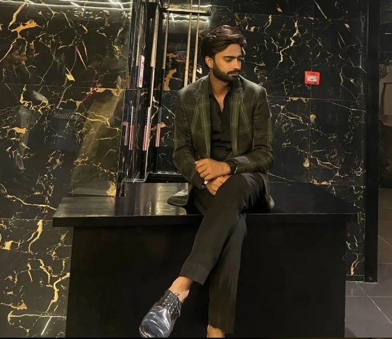

  

---

<table align="center" border="0">
  <tr>
    <td align="center" width="250">
      
       
      <b>Data Innovator</b>
    </td>
    <td width="550" valign="top">
      <h3>🚀 Who am I?</h3>
      
I am a <b>passionate Azure Data Engineer</b> with expertise in designing high-performance data platforms. I excel at bridging the gap between raw data and actionable intelligence.

      
   <h4>🎯 Core Focus</h4>

<ul style="list-style-type:none; padding-left:0;">

<li>🏗️ <b style="color:#00BFFF;">Architecture:</b> Building Medallion Data Lakes (Lakehouse)</li>

<li>⚡ <b style="color:#EF3E42;">Processing:</b> Mastering Big Data with PySpark & Databricks</li>

<li>🔄 <b style="color:#00BFFF;">Orchestration:</b> Designing complex ELT flows in ADF</li>

<li>📊 <b style="color:#F2C811;">Reporting:</b> Creating meaningful insights via Power BI</li>

</ul>

    </td>
  </tr>
</table>

---

## 🛠️ Specialized Tech Stack

  

---

## 📊 Analytics & Impact

  
  

  

---

## 📬 Connect With Me

  
  
  

